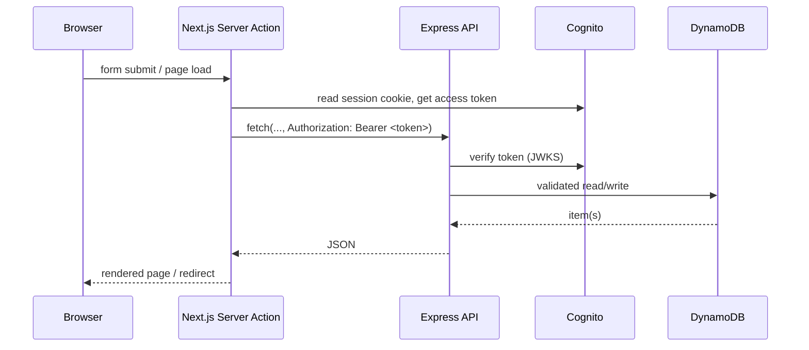

# LetsResolve

A support desk and lightweight CRM: link customers and contacts to the tickets raised
against them, work those tickets through a status/priority workflow with a full
comment and activity timeline, and publish knowledge-base articles that head off
repeat tickets. A dashboard rolls all of it up into ticket-volume and
resolution-time metrics.

Next.js 14 (App Router) front end with Cognito-backed auth, talking to a hardened
Express + TypeScript API over DynamoDB and S3.

[](https://github.com/point8290/LetsResolve/actions/workflows/ci.yml)

## Features

**Issue resolution**
- Tickets with status (`open` → `in_progress` → `resolved` → `closed`) and priority
  (`low`/`medium`/`high`/`urgent`), multiple file attachments, and assignment
- A comment/activity timeline per ticket — user comments and system-generated
  entries (status changes, reassignment, priority changes) in one chronological feed
- Filterable ticket list, admin-only delete

**CRM**
- Customers and Contacts as first-class entities, contacts managed inline on the
  customer record
- Tickets link to a customer/contact so support history rolls up per account
- Customer detail page shows every ticket raised against that account

**Dashboard**
- Ticket volume by status and priority, average resolution time, recent activity —
  computed by the API, rendered as accessible stat tiles and a labeled status
  breakdown (no color-only encoding)

**Knowledge base**
- Articles with the same create/edit/view/delete lifecycle as tickets

**Auth & access control**
- Sign-up, e-mail confirmation, login, password reset, and profile/e-mail/password
  updates through Amazon Cognito
- Every API request is authenticated: the Express API verifies the caller's Cognito
  access token itself rather than trusting whatever the front end sends
- Destructive actions (deleting a ticket, article, customer or contact) are
  restricted to the `Admins` Cognito group, enforced on the API — not just hidden
  in the UI
- Next.js middleware resolves the session server-side and gates `/dashboard`, with
  `/dashboard/admin` restricted to admins

**Engineering**
- Request validation with zod, centralized error handling, paginated list
  endpoints, `helmet` + rate limiting, randomized/type-restricted S3 upload keys
- 54 API tests (Jest + Supertest + a mocked DynamoDB client) and 31 front-end tests
  (Jest + React Testing Library)
- CI on every push/PR: lint, test, and a production build for both apps

## Architecture

```
lets-resolve/          Next.js 14 App Router · TypeScript · Tailwind · AWS Amplify
    app/                routes: auth flows, dashboard, tickets, customers, articles, profile
    ui/                 presentational components, grouped by feature
    lib/                Server Actions (data mutations/reads) + a single API client
    lib/server/         api-client.ts — attaches the caller's Cognito token to every
                         request to the API; every fetch in lib/ goes through it
    middleware.ts        server-side session check and admin gate

api/                    Express 4 · TypeScript
    middleware/          requireAuth (verifies the Cognito access token),
                          requireAdmin, request validation, error handling
    validation/           zod schemas for every mutable resource
    routes/, controller/  /ticket (+ nested /comments), /article, /customer
                          (+ nested /contacts), /dashboard, /user
    util/                 pagination, DynamoDB update-expression builder,
                          S3 upload key generation, activity-log helper
```

Data lives in DynamoDB; attachments stream straight to S3 through `multer-s3` and
are referenced by key on the record. The front end never talks to DynamoDB or S3
directly — every read and write goes through the API, and every Server Action in
`lib/` attaches the signed-in user's Cognito access token so the API can verify who
is calling.



## Running it locally

```bash
# API
cd api && npm i
cp .env.example .env.local        # AWS credentials, region, S3 bucket, Cognito pool/client
npm run dev                       # http://localhost:4000

# Front end
cd lets-resolve && npm i
cp .env.example .env.local        # Cognito user-pool id + client id, region, API URL
npm run dev                       # http://localhost:3000
```

You need a Cognito user pool (with an `Admins` group for admin-only actions), an S3
bucket, and five DynamoDB tables:

| Table      | Partition key | Sort key    |
|------------|----------------|-------------|
| `Ticket`   | `TicketId` (S) | —           |
| `Article`  | `ArticleId` (S)| —           |
| `Customer` | `CustomerId` (S)| —          |
| `Contact`  | `CustomerId` (S)| `ContactId` (S) |
| `Comment`  | `TicketId` (S) | `SortKey` (S) |

`Contact` and `Comment` use a composite key so listing a customer's contacts or a
ticket's comment timeline is a `Query`, not a full-table `Scan`.

## Testing

```bash
cd api && npm test           # 54 tests: validation, auth middleware, controllers
cd lets-resolve && npm test  # 31 tests: API client, badges/filters, admin-only UI gating
```

## Known gaps

Worth stating plainly:

- Ticket/customer list `Scan`s support pagination and a `status`/`priority`/
  `customerId` filter, but at real scale (thousands of items) those filters should
  move to a GSI instead of a filtered `Scan`.
- The dashboard summary recomputes counts from a full table scan on every request;
  at production volume that belongs in an aggregates table kept current via
  DynamoDB Streams, not computed live.
- No email notifications on ticket assignment/status change — the activity log
  captures the event, but nothing pushes it to the assignee.
- Single Cognito user pool, single AWS account/region — no multi-tenancy.

## License

Personal project; no license file yet.
